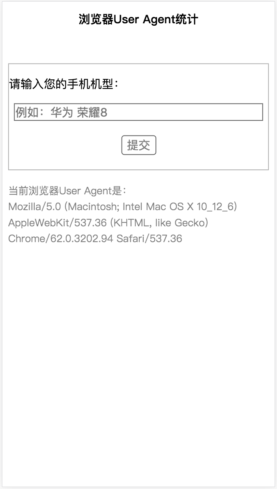

# 简易的User Agent统计工具

<div>
    
</div>

## 如何运行
```shell
> git clone https://github.com/dongrenguang/ua-stats.git
> cd ua-stats
> npm intall
> npm start 或者 node server/app.js
```
然后便可以访问：http://localhost:8081/

## 数据收集
最终的数据会存储在`/output/result.txt`中。

每一行的数据格式为：[手机型号]&nbsp;&nbsp;&nbsp;&nbsp;User Agent
